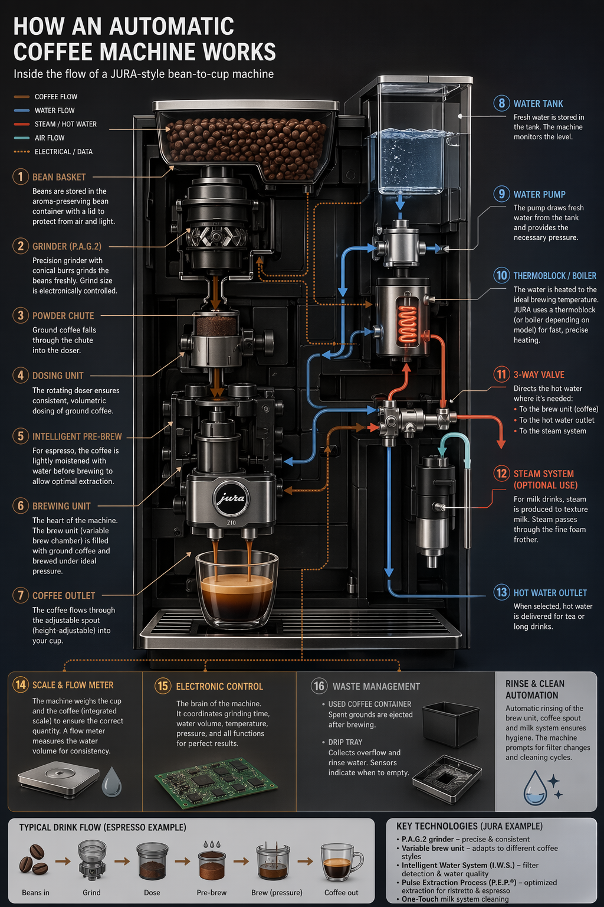
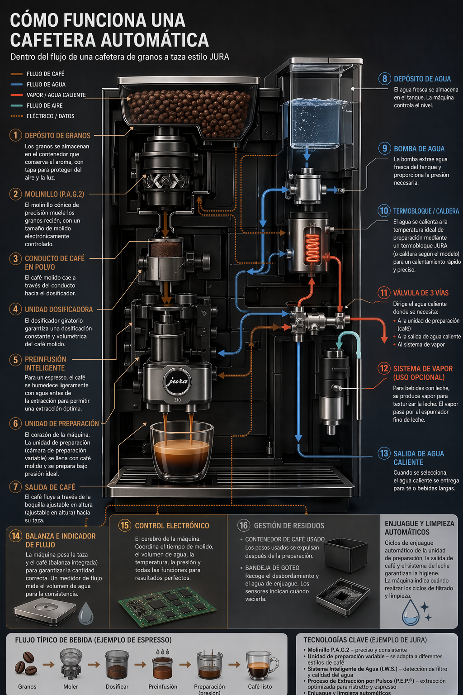
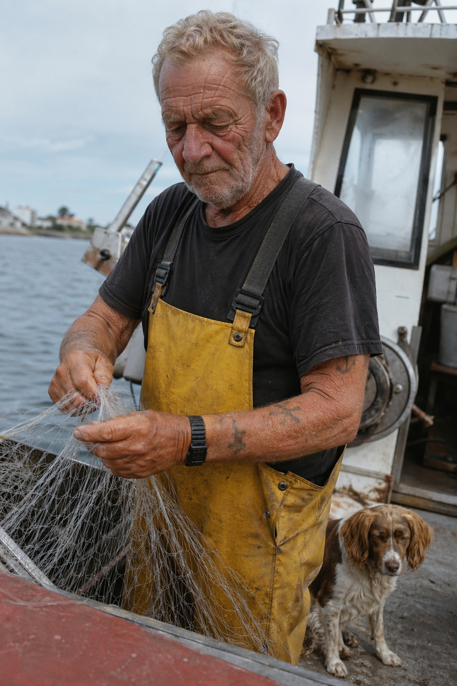
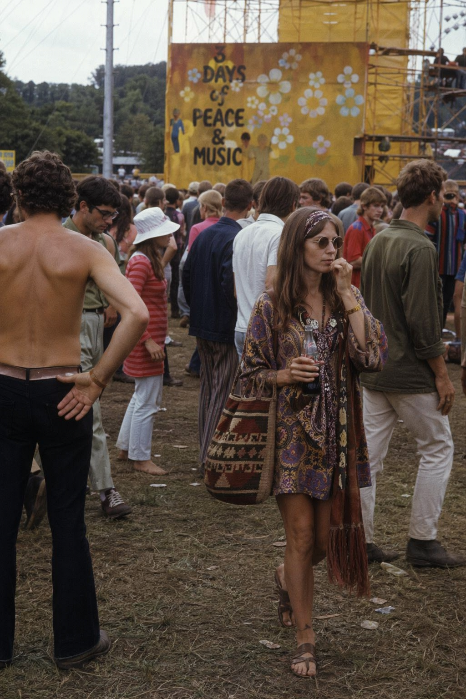
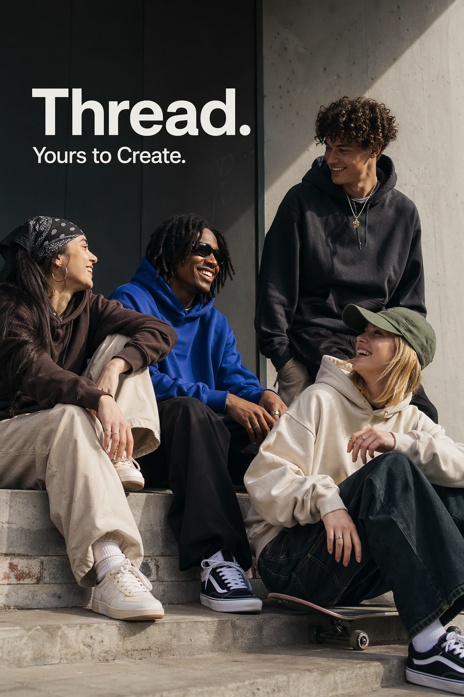
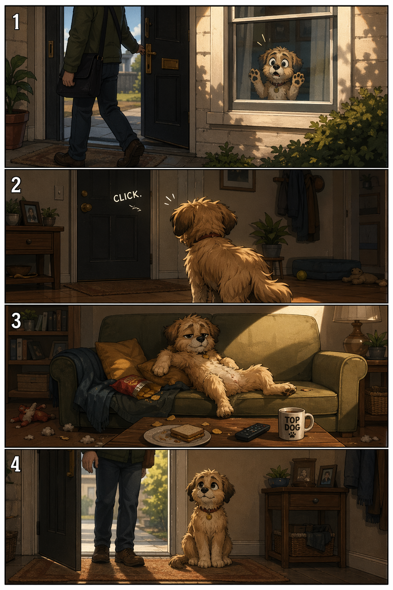
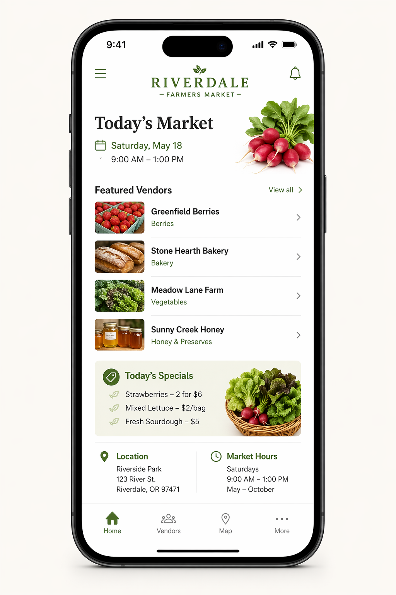
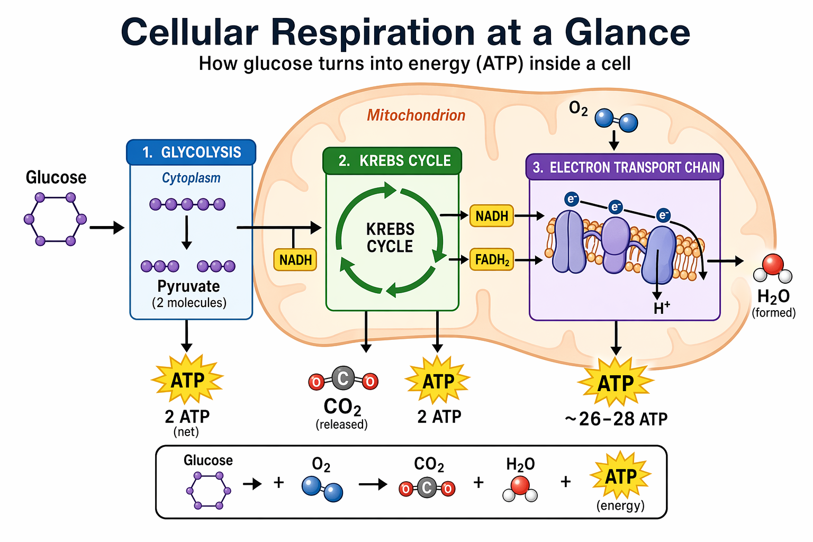
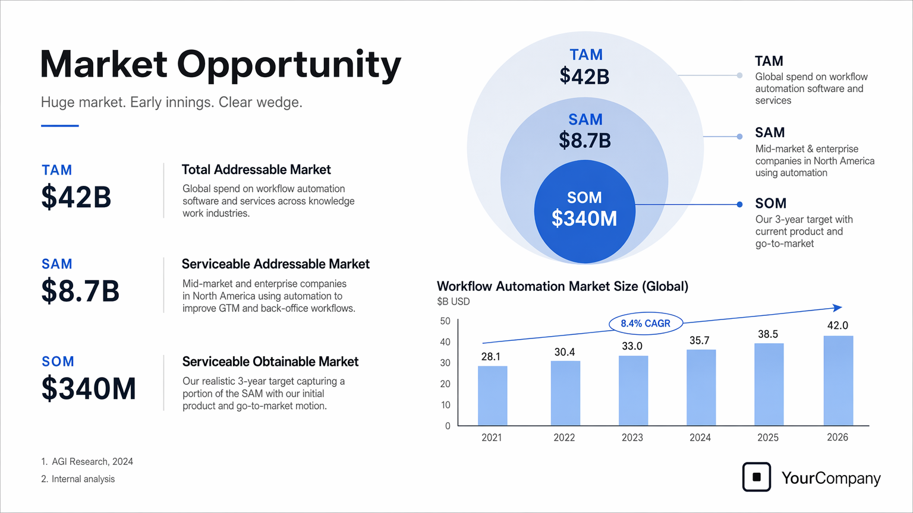

# 4. Use Cases

> 官方来源：[https://developers.openai.com/cookbook/examples/multimodal/image-gen-models-prompting-guide](https://developers.openai.com/cookbook/examples/multimodal/image-gen-models-prompting-guide)

## 章节目录

- [4.1 Infographics](./01-infographics/README.md)
- [4.2 Translation in Images](./02-translation-in-images/README.md)
- [4.3 Photorealistic Images](./03-photorealistic/README.md)
- [4.4 World knowledge](./04-world-knowledge/README.md)
- [4.5 Logo Generation](./05-logo-generation/README.md)
- [4.6 Ads Generation](./06-ads-generation/README.md)
- [4.7 Story-to-Comic Strip](./07-story-to-comic/README.md)
- [4.8 UI Mockups](./08-ui-mockups/README.md)
- [4.9 Scientific / Educational Visuals](./09-scientific-educational/README.md)
- [4.10 Slides, Diagrams, Charts, and Productivity Images](./10-slides-charts/README.md)

## Official content

## 4. Use Cases — Generate (text → image)

## 4.1 Infographics

Use infographics to explain structured information for a specific audience: students, executives, customers, or the general public. Examples include explainers, posters, labeled diagrams, timelines, and “visual wiki” assets. For dense layouts or heavy in-image text, it’s recommended to set output generation quality to “high”.

```
prompt = """
Create a detailed Infographic of the functioning and flow of an automatic coffee machine like a Jura.
From bean basket, to grinding, to scale, water tank, boiler, etc.
I'd like to understand technically and visually the flow.
"""

result = client.images.generate(
    model="gpt-image-2",
    prompt=prompt,
    size="1024x1536",
    quality="medium",
)

save_image(result, "infographic_coffee_machine_gpt-image-2.png")
```

Output Image:



## 4.2 Translation in Images

Used for localizing existing designs (ads, UI screenshots, packaging, infographics) into another language without rebuilding the layout from scratch. The key is to preserve everything except the text—keep typography style, placement, spacing, and hierarchy consistent—while translating verbatim and accurately, with no extra words, no reflow unless necessary, and no unintended edits to logos, icons, or imagery.

```
prompt = """
Translate the text in the infographic to Spanish. Do not change any other aspect of the image.
"""

result = client.images.edit(
    model="gpt-image-2",
    image=[
        open("../assets/official-cookbook/infographic_coffee_machine_gpt-image-2.png", "rb"),
    ],
    prompt=prompt,
    size="1024x1536",
    quality="medium",
)

save_image(result, "infographic_coffee_machine_sp_gpt-image-2.png")
```

Output Image:



## 4.3 Photorealistic Images that Feel “natural”

To get believable photorealism, prompt the model as if a real photo is being captured in the moment. Use photography language (lens, lighting, framing) and explicitly ask for real texture (pores, wrinkles, fabric wear, imperfections). Avoid words that imply studio polish or staging. When detail matters, set quality=“high”.

```
prompt = """
Create a photorealistic candid photograph of an elderly sailor standing on a small fishing boat.
He has weathered skin with visible wrinkles, pores, and sun texture, and a few faded traditional sailor tattoos on his arms.
He is calmly adjusting a net while his dog sits nearby on the deck. Shot like a 35mm film photograph, medium close-up at eye level, using a 50mm lens.
Soft coastal daylight, shallow depth of field, subtle film grain, natural color balance.
The image should feel honest and unposed, with real skin texture, worn materials, and everyday detail. No glamorization, no heavy retouching.
"""

result = client.images.generate(
    model="gpt-image-2",
    prompt=prompt,
    size="1024x1536",
    quality="medium",
)

save_image(result, "photorealism-gpt-image-2.png")
```

Output Image:



## 4.4 World knowledge

GPT image generation models can pair strong reasoning with world knowledge. For example, when asked to generate a scene set in Bethel, New York in August 1969, they can infer Woodstock and produce an accurate, context-appropriate image without being explicitly told about the event.

```
prompt = """
Create a realistic outdoor crowd scene in Bethel, New York on August 16, 1969.
Photorealistic, period-accurate clothing, staging, and environment.
"""

result = client.images.generate(
    model="gpt-image-2",
    prompt=prompt,
    size="1024x1536",
    quality="medium",
)

save_image(result, "world_knowledge-gpt-image-2.png")
```

Output Image:



## 4.5 Logo Generation

Strong logo generation comes from clear brand constraints and simplicity. Describe the brand’s personality and use case, then ask for a clean, original mark with strong shape, balanced negative space, and scalability across sizes.

You can specify parameter “n” to denote the number of variations you would like to generate.

```
prompt = """
Create an original, non-infringing logo for a company called Field & Flour, a local bakery.
The logo should feel warm, simple, and timeless. Use clean, vector-like shapes, a strong silhouette, and balanced negative space.
Favor simplicity over detail so it reads clearly at small and large sizes. Flat design, minimal strokes, no gradients unless essential.
Plain background. Deliver a single centered logo with generous padding. No watermark.
"""

result = client.images.generate(
    model="gpt-image-2",
    prompt=prompt,
    size="1024x1536",
    quality="medium",
    n=4     # Generate 4 versions of the logo
)

# Save all 4 images to separate files
for i, item in enumerate(result.data, start=1):
    image_base64 = item.b64_json
    image_bytes = base64.b64decode(image_base64)
    with open(f"output_images/logo_generation_{i}_gpt-image-2.png", "wb") as f:
        f.write(image_bytes)
```

Output Images:

| Option 1 | Option 2 | Option 3 | Option 4 |
| --- | --- | --- | --- |
|  |  |  |  |

## 4.6 Ads Generation

Ad generation works best when the prompt is written like a creative brief rather than a purely technical image spec. Describe the brand, audience, culture, concept, composition, and exact copy, then let the model make taste-driven creative decisions inside those boundaries. This is useful for early campaign exploration because the model can interpret audience cues, infer art direction, and propose visual details that make the ad feel considered rather than merely rendered.

For stronger results, include the brand positioning, desired vibe, target audience, scene, and tagline in the same prompt. If the text must appear in the image, quote it exactly and ask for clean, legible typography.

```
prompt = """
Give me a cool in culture ad / fashion shot for a brand called Thread.
It's a hip young street brand. The ad shows a group of friends hanging out together with the tagline "Yours to Create."
Make it feel like a polished campaign image for a youth streetwear audience: stylish, contemporary, energetic, and tasteful.
Use clean composition, strong color direction, natural poses, and premium fashion photography cues.
Render the tagline exactly once, clearly and legibly, integrated into the ad layout.
No extra text, no watermarks, no unrelated logos.
"""

result = client.images.generate(
    model="gpt-image-2",
    prompt=prompt,
    size="1024x1536",
    quality="medium",
)

save_image(result, "thread_ad_gpt-image-2.png")
```

Output Image:



## 4.7 Story-to-Comic Strip

For story-to-comic generation, define the narrative as a sequence of clear visual beats, one per panel. Keep descriptions concrete and action-focused so the model can translate the story into readable, well-paced panels.

```
prompt = """
Create a short vertical comic-style reel with 4 equal-sized panels.
Panel 1: The owner leaves through the front door. The pet is framed in the window behind them, small against the glass, eyes wide, paws pressed high, the house suddenly quiet.
Panel 2: The door clicks shut. Silence breaks. The pet slowly turns toward the empty house, posture shifting, eyes sharp with possibility.
Panel 3: The house transformed. The pet sprawls across the couch like it owns the place, crumbs nearby, sunlight cutting across the room like a spotlight.
Panel 4: The door opens. The pet is seated perfectly by the entrance, alert and composed, as if nothing happened.
"""

result = client.images.generate(
    model="gpt-image-2",
    prompt=prompt,
    size="1024x1536",
    quality="medium",
)

save_image(result, "comic_reel-gpt-image-2.png")
```

Output Image:



## 4.8 UI Mockups

UI mockups work best when you describe the product as if it already exists. Focus on layout, hierarchy, spacing, and real interface elements, and avoid concept art language so the result looks like a usable, shipped interface rather than a design sketch.

```
prompt = """
Create a realistic mobile app UI mockup for a local farmers market.
Show today’s market with a simple header, a short list of vendors with small photos and categories, a small “Today’s specials” section, and basic information for location and hours.
Design it to be practical, and easy to use. White background, subtle natural accent colors, clear typography, and minimal decoration.
It should look like a real, well-designed, beautiful app for a small local market.
Place the UI mockup in an iPhone frame.
"""

result = client.images.generate(
    model="gpt-image-2",
    prompt=prompt,
    size="1024x1536",
    quality="medium",
)

save_image(result, "ui_farmers_market_gpt-image-2.png")
```

Output Image:



## 4.9 Scientific / Educational Visuals

Scientific and educational visuals are strong fits for biology, chemistry, classroom explainers, flat scientific icon systems, diagrams, and learning assets. Prompt them like an instructional design brief: define the audience, lesson objective, visual format, required labels, and scientific constraints. For best results, ask for a clean, flat visual system with consistent icon style, clear arrows, readable labels, and enough white space for students to scan the concept quickly.

When accuracy matters, list the required components explicitly and say what should not be included. Use `quality="high"` for dense labels, diagrams, or assets that will be used in slides or course materials.

```
prompt = """
Create a simple biology diagram titled "Cellular Respiration at a Glance" for high school students.

Show how glucose turns into energy inside a cell. Include glycolysis, the Krebs cycle, and the electron transport chain.
Use arrows to connect the steps, and label the main molecules: glucose, pyruvate, ATP, NADH, FADH2, CO2, O2, and H2O.
Make it look like a clean classroom handout or slide, with a white background, simple icons, clear labels, and easy-to-read text.

Avoid tiny text, extra decoration, or anything that makes the diagram hard to understand.
"""

result = client.images.generate(
    model="gpt-image-2",
    prompt=prompt,
    size="1536x1024",
    quality="high",
)

save_image(result, "scientific_educational_cellular_respiration_gpt-image-2.png")
```

Output Image:



## 4.10 Slides, Diagrams, Charts, and Productivity Images

Productivity visuals work best when the prompt is written like an artifact spec rather than an illustration request. Name the exact deliverable (slide, workflow diagram, chart, page image), define the canvas and hierarchy, provide the real text or data, and describe the visual language. These prompts should include practical constraints: readable typography, polished spacing, no decorative clutter, and no generic stock-photo treatment.

For slides, charts, and diagram-heavy assets, include the numbers and labels directly in the prompt. Use a landscape size for deck-style outputs and `quality="high"` when the image contains small text, legends, axes, or footnotes.

```
prompt = """
Create one pitch-deck slide titled **"Market Opportunity"** that feels like a real Series A fundraising slide from a YC-backed startup.

Use a clean white background, modern sans-serif typography like Inter, and a crisp, minimal layout. The slide should include:

* A TAM/SAM/SOM concentric-circle diagram in muted blues and grays
* Specific, believable market sizing numbers:

  * **TAM:** $42B
  * **SAM:** $8.7B
  * **SOM:** $340M
* A clean bar chart below showing market growth from **2021 to 2026**, with a subtle upward trend
* Small footnotes: **"AGI Research, 2024"** and **"Internal analysis"**
* A company logo placeholder in the bottom-right corner

The design should look like it belongs in a deck that actually raised money: highly readable text, clear data hierarchy, polished spacing, and professional startup-style visual language.

Avoid clip art, stock photography, gradients, shadows, decorative elements, or anything that feels generic or overdesigned.
"""

result = client.images.generate(
    model="gpt-image-2",
    prompt=prompt,
    size="1536x864",
    quality="high",
)

save_image(result, "market_opportunity_slide_gpt-image-2.png")
```

Output Image:



## 中文翻译

第 4 章覆盖从文本生成图像的十类生产场景。每个场景的完整英文说明、提示词、Python 示例、本地官方图片和输入/输出角色表位于对应子目录：

| 章节 | 中文要点 |
|---|---|
| [4.1 信息图](./01-infographics/README.md) | 面向明确受众解释流程、结构和关系；密集文字需要清晰层级。 |
| [4.2 图像文字翻译](./02-translation-in-images/README.md) | 只改变图中文字，保持对象、构图、颜色和视觉风格。 |
| [4.3 自然的照片级图像](./03-photorealistic/README.md) | 描述人物、材质、镜头感、光线和真实的不完美细节。 |
| [4.4 世界知识](./04-world-knowledge/README.md) | 使用地点、日期和时代细节生成可信的历史或现实场景。 |
| [4.5 Logo 生成](./05-logo-generation/README.md) | 强调原创、清晰轮廓、负空间和大小尺寸下的可读性。 |
| [4.6 广告生成](./06-ads-generation/README.md) | 同时说明品牌、受众、视觉钩子、版式和精确文案。 |
| [4.7 故事转漫画](./07-story-to-comic/README.md) | 逐面板描述动作与情绪，保持角色、画风和叙事连续。 |
| [4.8 UI 模型](./08-ui-mockups/README.md) | 描述真实产品中的内容、导航、操作和可读排版。 |
| [4.9 科学/教育视觉](./09-scientific-educational/README.md) | 用标题、组件、箭头和精确标签构建易读的教学图。 |
| [4.10 幻灯片与图表](./10-slides-charts/README.md) | 说明信息层级、数据、图表、脚注和可比较的标签。 |

生成任务应先描述想要的完整画面，再补充文字、布局和排除项。Logo、广告、信息图、科学图表和幻灯片等文字密集场景尤其需要逐字指定文字、出现次数和位置。


## 本章图片

- [comic_reel-gpt-image-2.png](../assets/official-cookbook/comic_reel-gpt-image-2.png)
- [infographic_coffee_machine_gpt-image-2.png](../assets/official-cookbook/infographic_coffee_machine_gpt-image-2.png)
- [infographic_coffee_machine_sp_gpt-image-2.png](../assets/official-cookbook/infographic_coffee_machine_sp_gpt-image-2.png)
- [logo_generation_1_gpt-image-2.png](../assets/official-cookbook/logo_generation_1_gpt-image-2.png)
- [logo_generation_2_gpt-image-2.png](../assets/official-cookbook/logo_generation_2_gpt-image-2.png)
- [logo_generation_3_gpt-image-2.png](../assets/official-cookbook/logo_generation_3_gpt-image-2.png)
- [logo_generation_4_gpt-image-2.png](../assets/official-cookbook/logo_generation_4_gpt-image-2.png)
- [market_opportunity_slide_gpt-image-2.png](../assets/official-cookbook/market_opportunity_slide_gpt-image-2.png)
- [photorealism-gpt-image-2.png](../assets/official-cookbook/photorealism-gpt-image-2.png)
- [scientific_educational_cellular_respiration_gpt-image-2.png](../assets/official-cookbook/scientific_educational_cellular_respiration_gpt-image-2.png)
- [thread_ad_gpt-image-2.png](../assets/official-cookbook/thread_ad_gpt-image-2.png)
- [ui_farmers_market_gpt-image-2.png](../assets/official-cookbook/ui_farmers_market_gpt-image-2.png)
- [world_knowledge-gpt-image-2.png](../assets/official-cookbook/world_knowledge-gpt-image-2.png)
