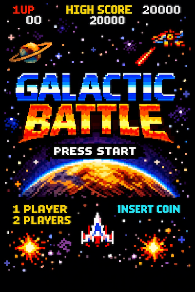
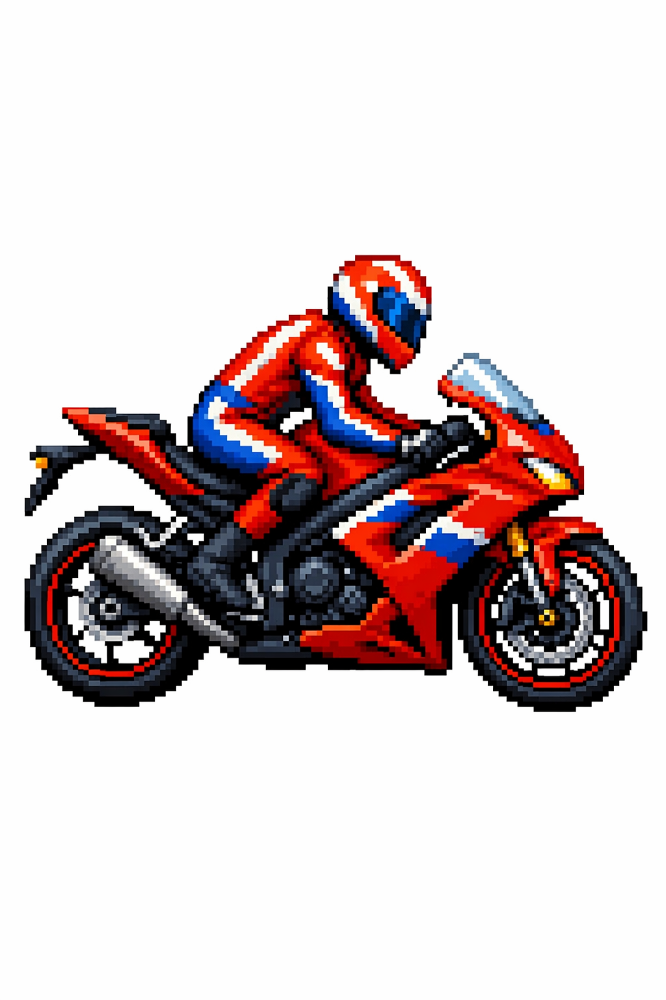

# 5.1 Style Transfer

> 官方来源：[https://developers.openai.com/cookbook/examples/multimodal/image-gen-models-prompting-guide](https://developers.openai.com/cookbook/examples/multimodal/image-gen-models-prompting-guide)

## Official content

## 5.1 Style Transfer

Style transfer is useful when you want to keep the *visual language* of a reference image (palette, texture, brushwork, film grain, etc.) while changing the subject or scene. For best results, describe what must stay consistent (style cues) and what must change (new content), and add hard constraints like background, framing, and “no extra elements” to prevent drift.

```
prompt = """
Use the same style from the input image and generate a man riding a motorcycle on a white background.
"""

result = client.images.edit(
    model="gpt-image-2",
    image=[
        open("../../assets/official-cookbook/pixels.png", "rb"),
    ],
    prompt=prompt,
    size="1024x1536",
    quality="medium",
)

save_image(result, "motorcycle_gpt-image-2.png")
```

Input Image:



Output Image:



## 中文整理

使用输入图片的相同风格，在白色背景上生成一个骑摩托车的男人。

## 本地图片

- 
- 

## 输入/输出角色

| 文件 | 角色 |
|---|---|
| `motorcycle_gpt-image-2.png` | output |
| `pixels.png` | input |

## 复现说明

本目录中的提示词和代码按官方页面整理；运行代码前请按第 3 章配置环境变量，并检查输入图片路径。
