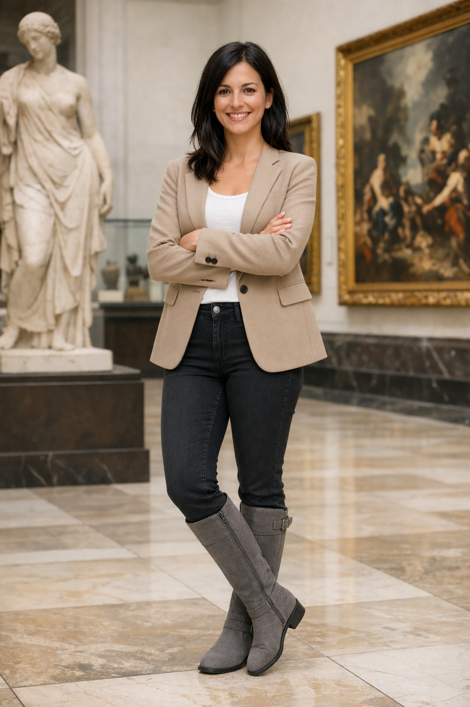
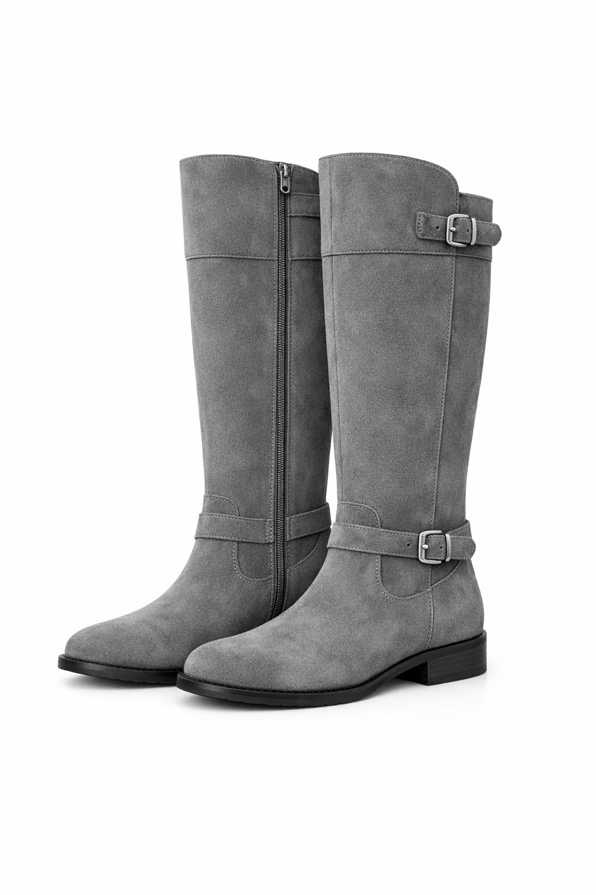
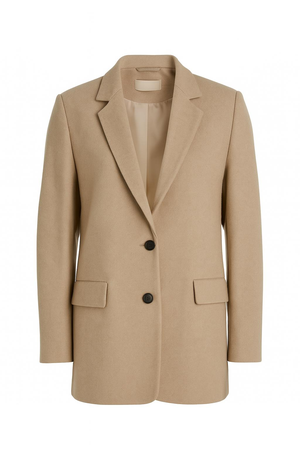
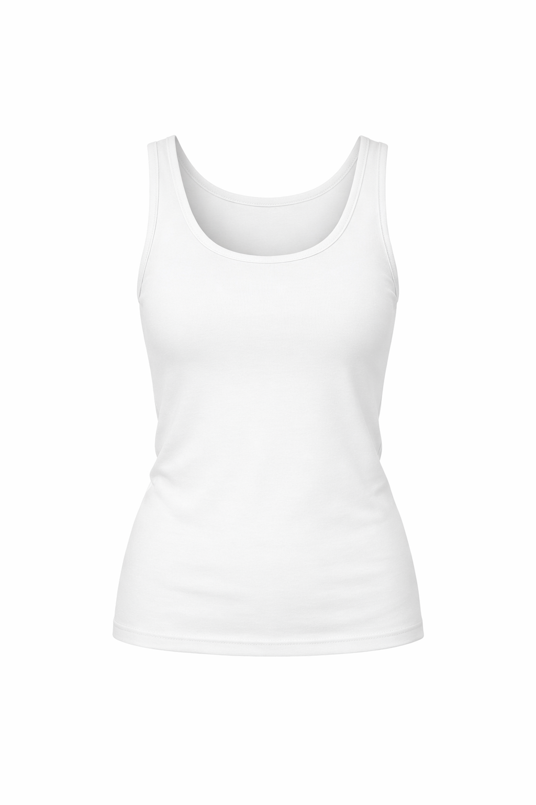
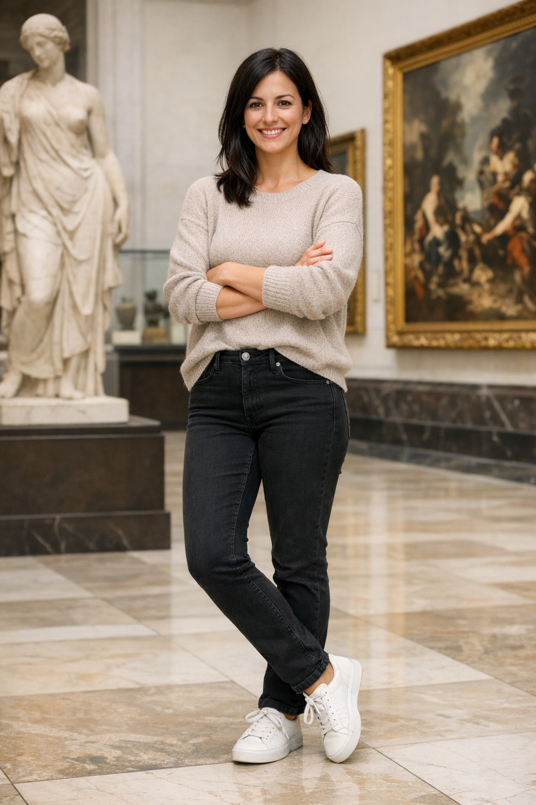

# 5.2 Virtual Clothing Try-On

> 官方来源：[https://developers.openai.com/cookbook/examples/multimodal/image-gen-models-prompting-guide](https://developers.openai.com/cookbook/examples/multimodal/image-gen-models-prompting-guide)

## Official content

## 5.2 Virtual Clothing Try-On

Virtual try-on is ideal for ecommerce previews where identity preservation is critical. The key is to explicitly lock the person (face, body shape, pose, hair, expression) and allow changes *only* to garments, then require realistic fit (draping, folds, occlusion) plus consistent lighting/shadows so the outfit looks naturally worn—not pasted on.

```
prompt = """
Edit the image to dress the woman using the provided clothing images. Do not change her face, facial features, skin tone, body shape, pose, or identity in any way. Preserve her exact likeness, expression, hairstyle, and proportions. Replace only the clothing, fitting the garments naturally to her existing pose and body geometry with realistic fabric behavior. Match lighting, shadows, and color temperature to the original photo so the outfit integrates photorealistically, without looking pasted on. Do not change the background, camera angle, framing, or image quality, and do not add accessories, text, logos, or watermarks.
"""

result = client.images.edit(
    model="gpt-image-2",
    image=[
        open("../../assets/official-cookbook/woman_in_museum.png", "rb"),
        open("../../assets/official-cookbook/tank_top.png", "rb"),
        open("../../assets/official-cookbook/jacket.png", "rb"),
        open("../../assets/official-cookbook/boots.png", "rb"),
    ],
    prompt=prompt,
    size="1024x1536",
    quality="medium",
)

save_image(result, "outfit_gpt-image-2.png")
```

Input Images:

| Full Body | Item 1 |
| --- | --- |
|  |  |
| Item 2 | Item 3 |
|  |  |

Output Image:



## 中文整理

使用提供的服装图片为女性换装。不要改变她的脸、五官、肤色、体型、姿势或身份；保持她的相貌、表情、发型和比例完全一致。只替换服装，使其自然贴合现有姿势和身体几何，呈现真实的面料行为；匹配原图的光线、阴影和色温，让服装照片级融合而不是像贴上去的。不要改变背景、相机角度、构图或图像质量，也不要添加配饰、文字、Logo 或水印。

## 本地图片

- 
- 
- 
- 
- 

## 输入/输出角色

| 文件 | 角色 |
|---|---|
| `boots.png` | input: clothing |
| `jacket.png` | input: clothing |
| `outfit_gpt-image-2.png` | output |
| `tank_top.png` | input: clothing |
| `woman_in_museum.png` | input: person |

## 复现说明

本目录中的提示词和代码按官方页面整理；运行代码前请按第 3 章配置环境变量，并检查输入图片路径。
