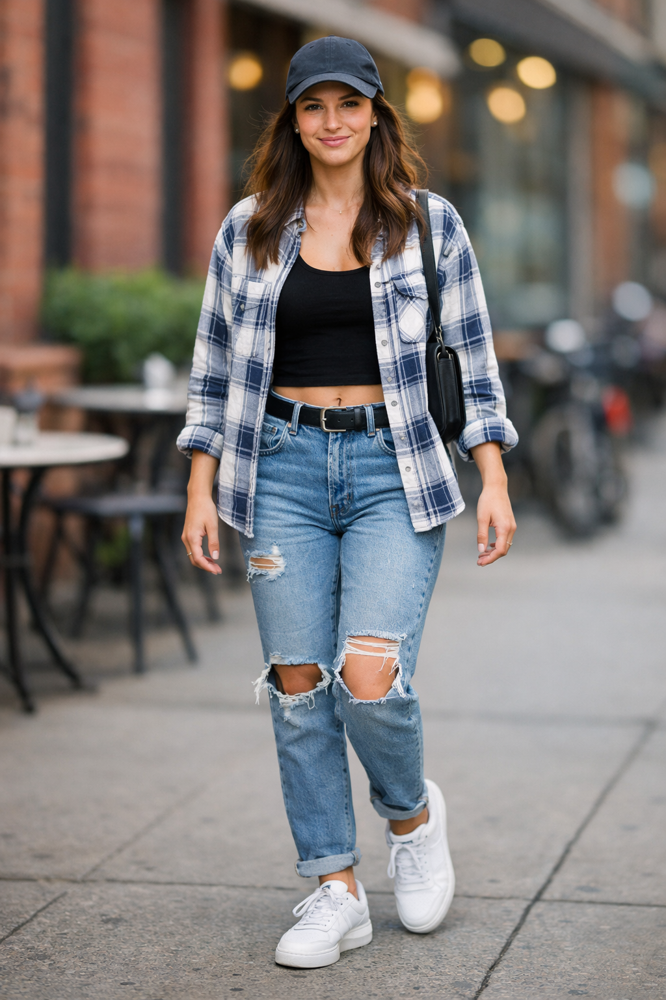
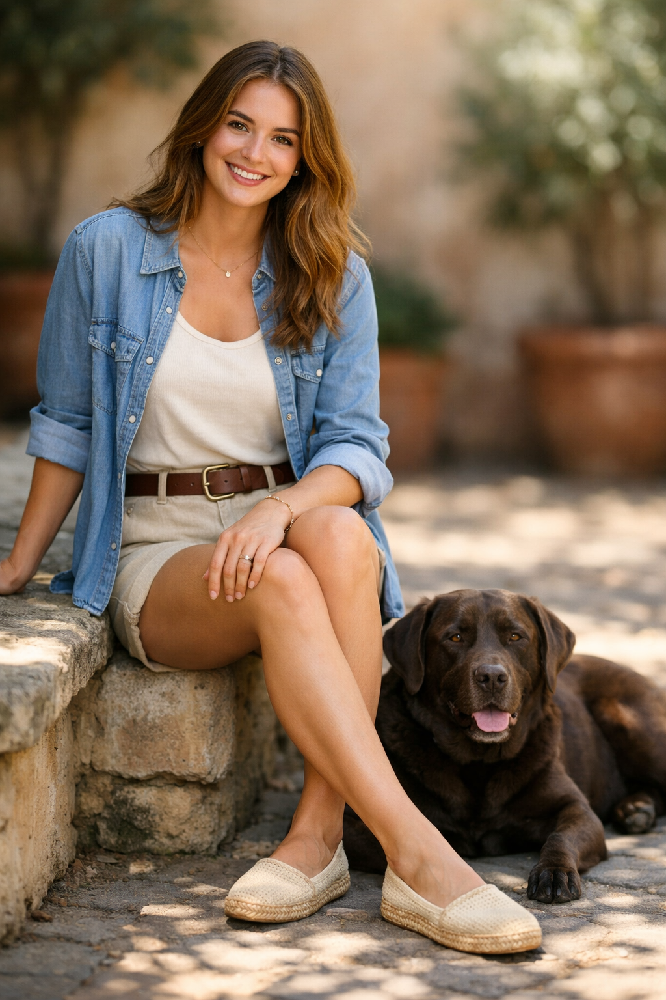
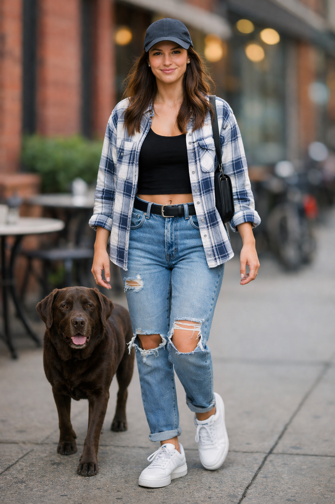

# 5.9 Multi-Image Referencing and Compositing

> 官方来源：[https://developers.openai.com/cookbook/examples/multimodal/image-gen-models-prompting-guide](https://developers.openai.com/cookbook/examples/multimodal/image-gen-models-prompting-guide)

## Official content

## 5.9 Multi-Image Referencing and Compositing

Used to combine elements from multiple inputs into a single, believable image—great for “insert this object/person into that scene” workflows without re-generating everything. The key is to clearly specify what to transplant (the dog from image 2), where it should go (right next to the woman in image 1), and what must remain unchanged (scene, background, framing), while matching lighting, perspective, scale, and shadows so the composite looks naturally captured in the original photo.

```
prompt = """
Place the dog from the second image into the setting of image 1, right next to the woman, use the same style of lighting, composition and background. Do not change anything else.
"""

result = client.images.edit(
    model="gpt-image-2",
    image=[
        open("../../assets/official-cookbook/test_woman.png", "rb"),
        open("../../assets/official-cookbook/test_woman_2.png", "rb"),
    ],
    prompt=prompt,
    size="1024x1536",
    quality="medium",
)

save_image(result, "test_woman_with_dog_gpt-image-2.png")
```

Input and output images:

| Original Input | Remove Red Stripes | Change Hat Color |
| --- | --- | --- |
|  |  |  |

## 中文整理

将第二张图片中的狗放入第一张图片的场景中，紧挨着女性；使用与第一张图相同的光线、构图和背景风格。不要改变任何其他内容。

## 本地图片

- 
- 
- 

## 输入/输出角色

| 文件 | 角色 |
|---|---|
| `test_woman.png` | input: target scene |
| `test_woman_2.png` | input: dog reference |
| `test_woman_with_dog_gpt-image-2.png` | output |

## 复现说明

本目录中的提示词和代码按官方页面整理；运行代码前请按第 3 章配置环境变量，并检查输入图片路径。
