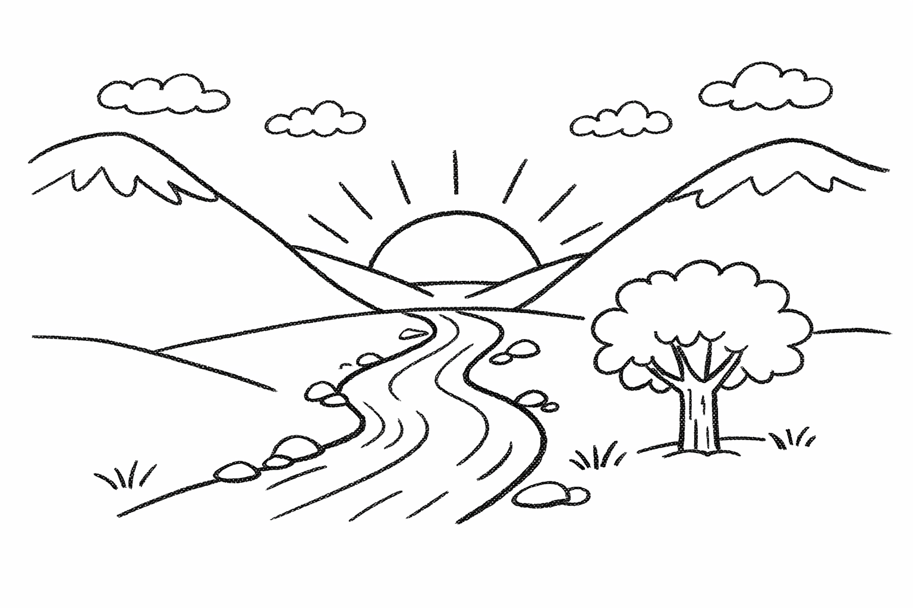
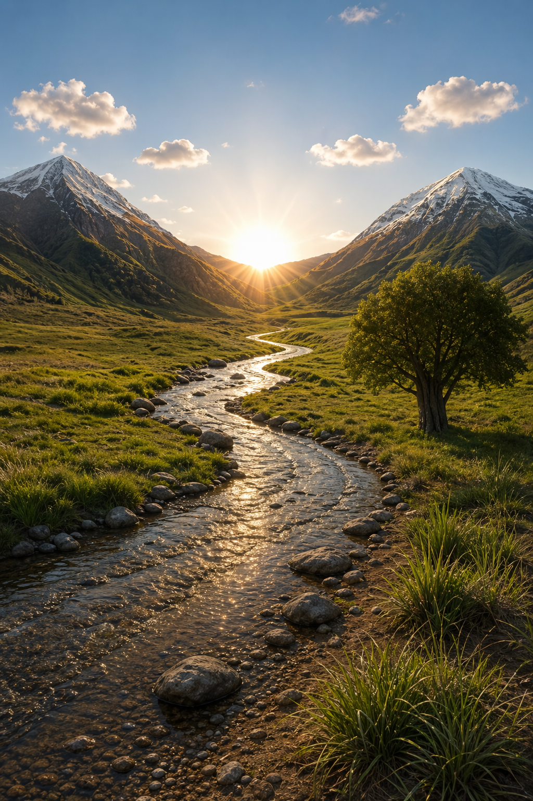
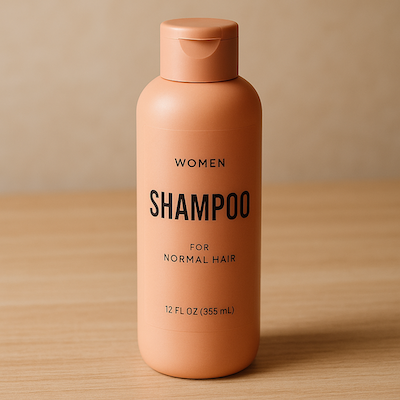
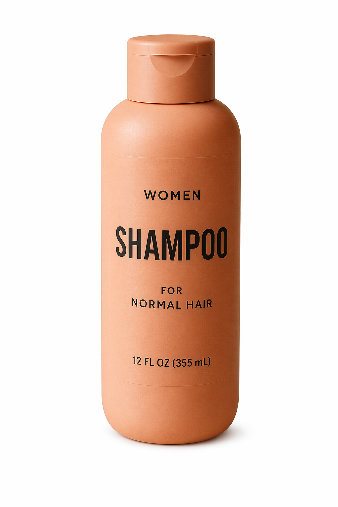
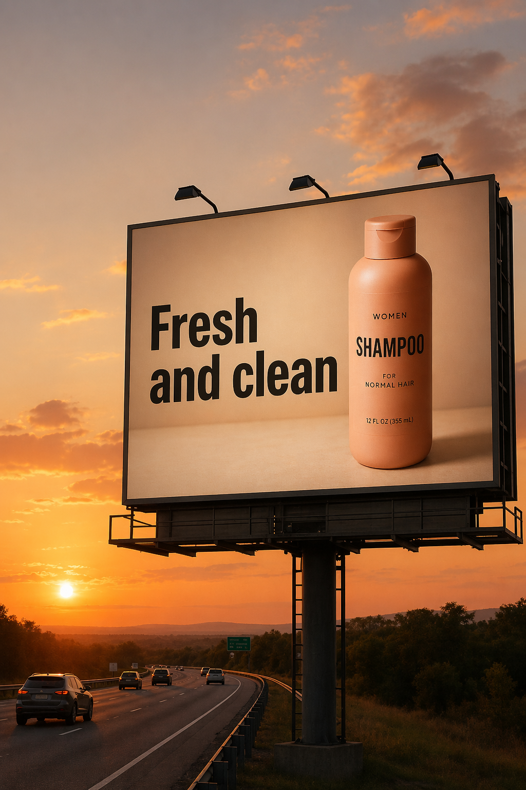
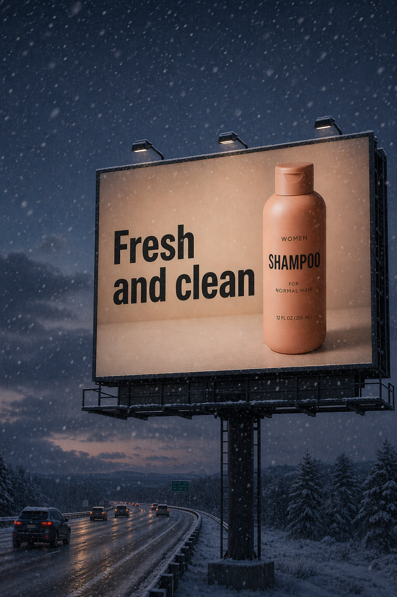

# 5. Use cases

> 官方来源：[https://developers.openai.com/cookbook/examples/multimodal/image-gen-models-prompting-guide](https://developers.openai.com/cookbook/examples/multimodal/image-gen-models-prompting-guide)

## 章节目录

- [5.1 Style Transfer](./01-style-transfer/README.md)
- [5.2 Virtual Clothing Try-On](./02-virtual-try-on/README.md)
- [5.3 Drawing → Image (Rendering)](./03-drawing-to-image/README.md)
- [5.4 Product Mockups](./04-product-mockups/README.md)
- [5.5 Marketing Creatives with Real Text In-Image](./05-marketing-creatives/README.md)
- [5.6 Lighting and Weather Transformation](./06-lighting-weather/README.md)
- [5.7 Object Removal](./07-object-removal/README.md)
- [5.8 Insert the Person Into a Scene](./08-insert-person-scene/README.md)
- [5.9 Multi-Image Referencing and Compositing](./09-multi-image-compositing/README.md)

## Official content

## 5. Use cases — Edit (text + image → image)

## 5.1 Style Transfer

Style transfer is useful when you want to keep the *visual language* of a reference image (palette, texture, brushwork, film grain, etc.) while changing the subject or scene. For best results, describe what must stay consistent (style cues) and what must change (new content), and add hard constraints like background, framing, and “no extra elements” to prevent drift.

```
prompt = """
Use the same style from the input image and generate a man riding a motorcycle on a white background.
"""

result = client.images.edit(
    model="gpt-image-2",
    image=[
        open("../assets/official-cookbook/pixels.png", "rb"),
    ],
    prompt=prompt,
    size="1024x1536",
    quality="medium",
)

save_image(result, "motorcycle_gpt-image-2.png")
```

Input Image:


Output Image:


## 5.2 Virtual Clothing Try-On

Virtual try-on is ideal for ecommerce previews where identity preservation is critical. The key is to explicitly lock the person (face, body shape, pose, hair, expression) and allow changes *only* to garments, then require realistic fit (draping, folds, occlusion) plus consistent lighting/shadows so the outfit looks naturally worn—not pasted on.

```
prompt = """
Edit the image to dress the woman using the provided clothing images. Do not change her face, facial features, skin tone, body shape, pose, or identity in any way. Preserve her exact likeness, expression, hairstyle, and proportions. Replace only the clothing, fitting the garments naturally to her existing pose and body geometry with realistic fabric behavior. Match lighting, shadows, and color temperature to the original photo so the outfit integrates photorealistically, without looking pasted on. Do not change the background, camera angle, framing, or image quality, and do not add accessories, text, logos, or watermarks.
"""

result = client.images.edit(
    model="gpt-image-2",
    image=[
        open("../assets/official-cookbook/woman_in_museum.png", "rb"),
        open("../assets/official-cookbook/tank_top.png", "rb"),
        open("../assets/official-cookbook/jacket.png", "rb"),
        open("../assets/official-cookbook/boots.png", "rb"),
    ],
    prompt=prompt,
    size="1024x1536",
    quality="medium",
)

save_image(result, "outfit_gpt-image-2.png")
```

Input Images:

| Full Body | Item 1 |
| --- | --- |
|  |  |
| Item 2 | Item 3 |
|  |  |

Output Image:


## 5.3 Drawing → Image (Rendering)

Sketch-to-render workflows are great for turning rough drawings into photorealistic concepts while keeping the original intent. Treat the prompt like a spec: preserve layout and perspective, then *add realism* by specifying plausible materials, lighting, and environment. Include “do not add new elements/text” to avoid creative reinterpretations.

```
prompt = """
Turn this drawing into a photorealistic image.
Preserve the exact layout, proportions, and perspective.
Choose realistic materials and lighting consistent with the sketch intent.
Do not add new elements or text.
"""

result = client.images.edit(
    model="gpt-image-2",
    image=[
        open("../assets/official-cookbook/drawings.png", "rb"),
    ],
    prompt=prompt,
    size="1024x1536",
    quality="medium",
)

save_image(result, "realistic_valley_gpt-image-2.png")
```

Input Image:



Output Image:



## 5.4 Product Mockups (transparent background + label integrity)

Product extraction and mockup prep is commonly used for catalogs, marketplaces, and design systems. Success depends on edge quality (clean silhouette, no fringing/halos) and label integrity (text stays sharp and unchanged). Transparent backgrounds are available in preview for `gpt-image-2`; request `background="transparent"` with `output_format="png"` (the default) or `output_format="webp"` to create a reusable product cutout directly. `jpeg` does not support transparent backgrounds. Ask for an isolated subject, preserve the existing product geometry and label, and omit solid backdrops, checkerboards, and unnecessary shadows. Omit `output_compression` for PNG output; WebP supports optional compression.

```
prompt = """
Extract the product from the input image and isolate it on a fully transparent background.
Output: centered product, crisp silhouette, no halos/fringing.
Preserve product geometry and label legibility exactly.
Add only light polishing. Do not add a solid backdrop, checkerboard, scenery, or shadow.
Do not restyle the product; remove the background and preserve clean alpha transparency.
"""

result = client.images.edit(
    model="gpt-image-2",
    image=[
        open("../assets/official-cookbook/shampoo.png", "rb"),
    ],
    prompt=prompt,
    size="1024x1536",
    quality="medium",
    background="transparent",
    output_format="png",
)

save_image(result, "extract_product_gpt-image-2.png")
```

Input Image:



Output Image:



## 5.5 Marketing Creatives with Real Text In-Image

Marketing creatives with real in-image text are great for rapid ad concepting, but typography needs explicit constraints. Put the exact copy in quotes, demand verbatim rendering (no extra characters), and describe placement and font style. If text fidelity is imperfect, keep the prompt strict and iterate—small wording/layout tweaks usually improve legibility.

```
prompt = """
Create a realistic billboard mockup of the shampoo on a highway scene during sunset.
Billboard text (EXACT, verbatim, no extra characters):
"Fresh and clean"
Typography: bold sans-serif, high contrast, centered, clean kerning.
Ensure text appears once and is perfectly legible.
No watermarks, no logos.
"""

result = client.images.edit(
    model="gpt-image-2",
    image=[
        open("../assets/official-cookbook/shampoo.png", "rb"),
    ],
    prompt=prompt,
    size="1024x1536",
    quality="medium",
)

save_image(result, "billboard_gpt-image-2.png")
```

Input Image:


Output Image:



## 5.6 Lighting and Weather Transformation

Used to re-stage a photo for different moods, seasons, or time-of-day variants (e.g., sunny → overcast, daytime → dusk, clear → snowy) while keeping the scene composition intact. The key is to change only environmental conditions—lighting direction/quality, shadows, atmosphere, precipitation, and ground wetness—while preserving identity, geometry, camera angle, and object placement so it still reads as the same original photo.

```
prompt = """
Make it look like a winter evening with snowfall.
"""

result = client.images.edit(
    model="gpt-image-2",
    image=[
        open("../assets/official-cookbook/billboard_gpt-image-2.png", "rb"),
    ],
    prompt=prompt,
    size="1024x1536",
    quality="medium",
)

save_image(result, "billboard_winter_gpt-image-2.png")
```

Output Image:



## 5.7 Object Removal

Person-in-scene compositing is useful for storyboards, campaigns, and “what if” scenarios where facial/identity preservation matters. Anchor realism by specifying a grounded photographic look (natural lighting, believable detail, no cinematic grading), and lock what must not change about the subject. When available, higher input fidelity helps maintain likeness during larger scene edits.

```
prompt = """
Remove the flower from man's hand. Do not change anything else.
"""

result = client.images.edit(
    model="gpt-image-2",
    image=[
        open("../assets/official-cookbook/man_with_blue_hat.png", "rb"),
    ],
    prompt=prompt,
    size="1024x1536",
    quality="medium",
)

save_image(result, "man_with_no_flower_gpt-image-2.png")
```

Input and output images:

| Original Input | Output Image |
| --- | --- |
|  |  |

## 5.8 Insert the Person Into a Scene

Person-in-scene compositing is useful for storyboards, campaigns, and “what if” scenarios where facial/identity preservation matters. Anchor realism by specifying a grounded photographic look (natural lighting, believable detail, no cinematic grading), and lock what must not change about the subject. When available, higher input fidelity helps maintain likeness during larger scene edits.

```
prompt = """
Generate a highly realistic action scene where this person is running away from a large, realistic brown bear attacking a campsite. The image should look like a real photograph someone could have taken, not an overly enhanced or cinematic movie-poster image.
She is centered in the image but looking away from the camera, wearing outdoorsy camping attire, with dirt on her face and tears in her clothing. She is clearly afraid but focused on escaping, running away from the bear as it destroys the campsite behind her.
The campsite is in Yosemite National Park, with believable natural details. The time of day is dusk, with natural lighting and realistic colors. Everything should feel grounded, authentic, and unstyled, as if captured in a real moment. Avoid cinematic lighting, dramatic color grading, or stylized composition.
"""

result = client.images.edit(
    model="gpt-image-2",
    image=[
        open("../assets/official-cookbook/woman_in_museum.png", "rb"),
    ],
    prompt=prompt,
    size="1024x1536",
    quality="medium",
)

save_image(result, "scene_gpt-image-2.png")
```

Output Image:

```
```

## 5.9 Multi-Image Referencing and Compositing

Used to combine elements from multiple inputs into a single, believable image—great for “insert this object/person into that scene” workflows without re-generating everything. The key is to clearly specify what to transplant (the dog from image 2), where it should go (right next to the woman in image 1), and what must remain unchanged (scene, background, framing), while matching lighting, perspective, scale, and shadows so the composite looks naturally captured in the original photo.

```
prompt = """
Place the dog from the second image into the setting of image 1, right next to the woman, use the same style of lighting, composition and background. Do not change anything else.
"""

result = client.images.edit(
    model="gpt-image-2",
    image=[
        open("../assets/official-cookbook/test_woman.png", "rb"),
        open("../assets/official-cookbook/test_woman_2.png", "rb"),
    ],
    prompt=prompt,
    size="1024x1536",
    quality="medium",
)

save_image(result, "test_woman_with_dog_gpt-image-2.png")
```

Input and output images:

| Original Input | Remove Red Stripes | Change Hat Color |
| --- | --- | --- |
|  |  |  |

## 中文翻译

第 5 章覆盖“文本 + 图片 → 图片”的九类编辑场景。编辑提示词的核心是把改变范围写窄，把必须保持的内容写全。`gpt-image-2` 自动按高保真处理输入图片，不应使用 `input_fidelity`。

| 章节 | 中文要点 |
|---|---|
| [5.1 风格迁移](./01-style-transfer/README.md) | 使用输入图作为风格参考，只替换主体内容。 |
| [5.2 虚拟试穿](./02-virtual-try-on/README.md) | 锁定人物脸部、身份、体型、姿势、发型、背景和光线，只替换衣物。 |
| [5.3 草图转图像](./03-drawing-to-image/README.md) | 保持草图布局、比例、透视和主体位置，再补足真实材质与光线。 |
| [5.4 产品模型](./04-product-mockups/README.md) | 抠出产品并保持几何形状、材质、颜色和标签完整。 |
| [5.5 带真实文字的营销创意](./05-marketing-creatives/README.md) | 让产品自然进入环境，并逐字渲染唯一的广告文案。 |
| [5.6 光照与天气](./06-lighting-weather/README.md) | 只改变环境条件，同时保持主体、构图、服装和无关物体。 |
| [5.7 物体移除](./07-object-removal/README.md) | 移除指定对象并自然重建背景，不改变其他细节。 |
| [5.8 插入人物](./08-insert-person-scene/README.md) | 将人物放入新场景，匹配尺度、透视、光线和阴影。 |
| [5.9 多图引用与合成](./09-multi-image-compositing/README.md) | 明确每张图的来源角色、目标位置和不变元素。 |

推荐的编辑结构是：`Change` 写唯一要改变的对象；`Preserve` 写身份、几何、姿势、构图、标签和背景；`Do not change` 作为兜底禁止额外修改。多轮编辑中重复这些不变量，可以降低前一步结果发生漂移的概率。


## 本章图片

- [billboard_gpt-image-2.png](../assets/official-cookbook/billboard_gpt-image-2.png)
- [billboard_winter_gpt-image-2.png](../assets/official-cookbook/billboard_winter_gpt-image-2.png)
- [boots.png](../assets/official-cookbook/boots.png)
- [drawings.png](../assets/official-cookbook/drawings.png)
- [extract_product_gpt-image-2.png](../assets/official-cookbook/extract_product_gpt-image-2.png)
- [jacket.png](../assets/official-cookbook/jacket.png)
- [man_with_blue_hat.png](../assets/official-cookbook/man_with_blue_hat.png)
- [man_with_no_flower_gpt-image-2.png](../assets/official-cookbook/man_with_no_flower_gpt-image-2.png)
- [motorcycle_gpt-image-2.png](../assets/official-cookbook/motorcycle_gpt-image-2.png)
- [outfit_gpt-image-2.png](../assets/official-cookbook/outfit_gpt-image-2.png)
- [pixels.png](../assets/official-cookbook/pixels.png)
- [realistic_valley_gpt-image-2.png](../assets/official-cookbook/realistic_valley_gpt-image-2.png)
- [shampoo.png](../assets/official-cookbook/shampoo.png)
- [tank_top.png](../assets/official-cookbook/tank_top.png)
- [test_woman.png](../assets/official-cookbook/test_woman.png)
- [test_woman_2.png](../assets/official-cookbook/test_woman_2.png)
- [test_woman_with_dog_gpt-image-2.png](../assets/official-cookbook/test_woman_with_dog_gpt-image-2.png)
- [woman_in_museum.png](../assets/official-cookbook/woman_in_museum.png)
