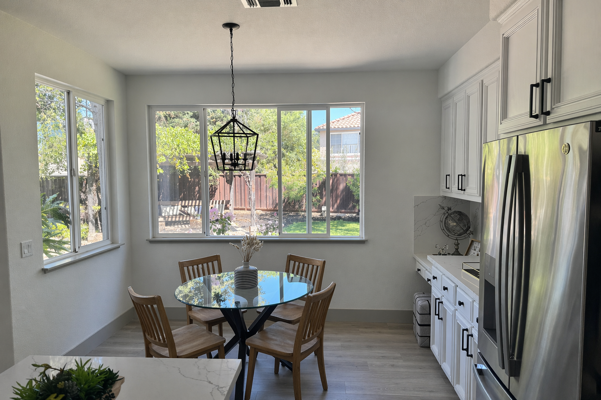
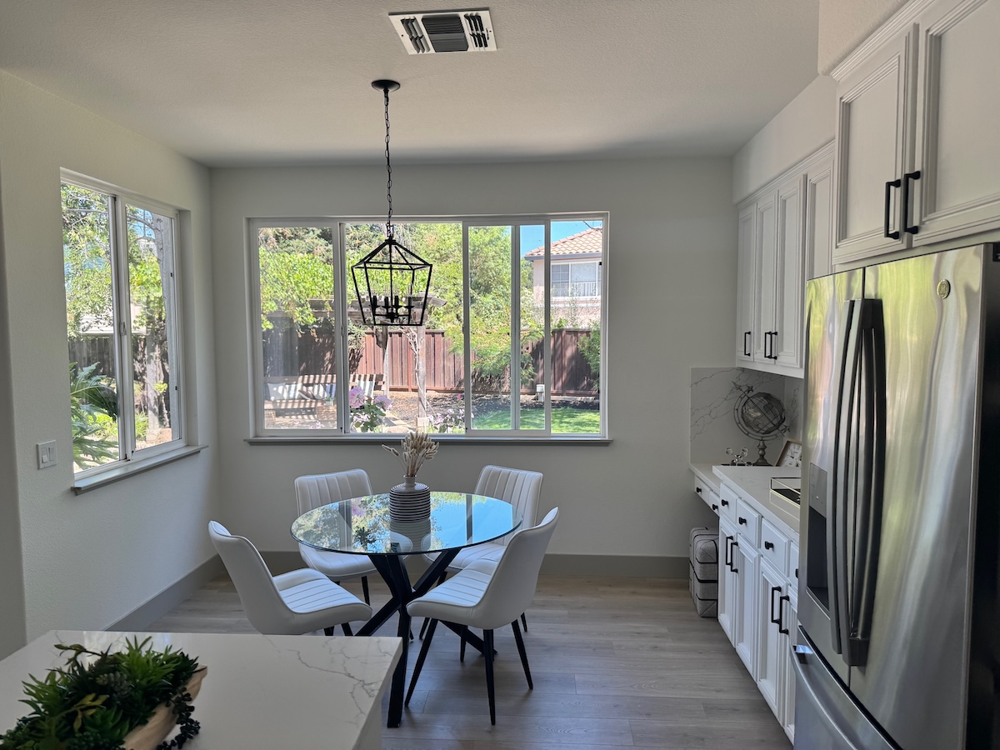

# 6.1 Interior design

> 官方来源：[https://developers.openai.com/cookbook/examples/multimodal/image-gen-models-prompting-guide](https://developers.openai.com/cookbook/examples/multimodal/image-gen-models-prompting-guide)

## Official content

## 6.1 Interior design “swap” (precision edits)

Used for visualizing furniture or decor changes in real spaces without re-rendering the entire scene. The goal is surgical realism: swap a single object while preserving camera angle, lighting, shadows, and surrounding context so the edit looks like a real photograph, not a redesign.

```
prompt = """
In this room photo, replace ONLY white with chairs made of wood.
Preserve camera angle, room lighting, floor shadows, and surrounding objects.
Keep all other aspects of the image unchanged.
Photorealistic contact shadows and fabric texture.
"""

result = client.images.edit(
    model="gpt-image-2",
    image=[
        open("../../assets/official-cookbook/kitchen.jpeg", "rb"),
    ],
    prompt=prompt,
    size="1536x1024",
    quality="medium",
)

save_image(result, "kitchen-chairs_gpt-image-2.png")
```

Input and output images:

| Input Image | Output Image |
| --- | --- |
|  |  |

## 中文整理

在这张房间照片中，只把白色椅子替换成木质椅子。保持相机角度、房间光线、地面阴影和周围物体不变；其他所有方面都保持不变，并生成真实的接触阴影和材质纹理。

## 本地图片

- 
- 

## 输入/输出角色

| 文件 | 角色 |
|---|---|
| `kitchen-chairs_gpt-image-2.png` | output |
| `kitchen.jpeg` | input |

## 复现说明

本目录中的提示词和代码按官方页面整理；运行代码前请按第 3 章配置环境变量，并检查输入图片路径。
