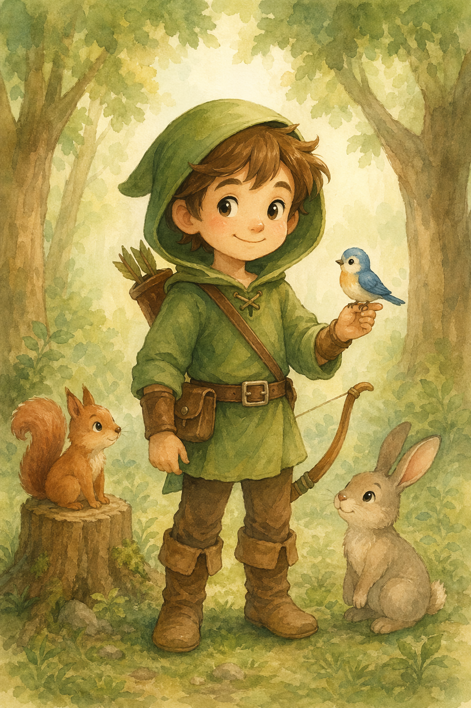
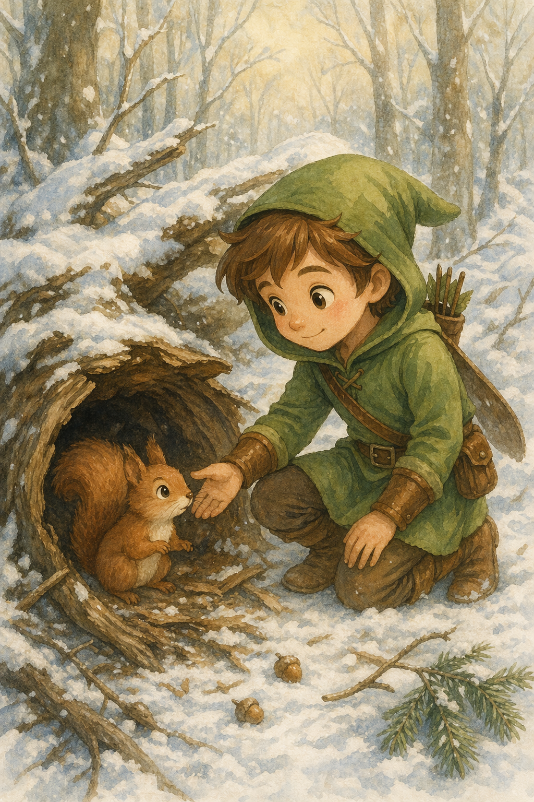

# 6. Additional High-Value Use Cases

> 官方来源：[https://developers.openai.com/cookbook/examples/multimodal/image-gen-models-prompting-guide](https://developers.openai.com/cookbook/examples/multimodal/image-gen-models-prompting-guide)

## 章节目录

- [6.1 Interior design](./01-interior-design-swap/README.md)
- [6.2 3D pop-up holiday card](./02-holiday-card/README.md)
- [6.3 Collectible Action Figure](./03-collectible-figure/README.md)
- [6.4 Children’s Book Art](./04-childrens-book-art/README.md)

## Official content

## 6. Additional High-Value Use Cases

## 6.1 Interior design “swap” (precision edits)

Used for visualizing furniture or decor changes in real spaces without re-rendering the entire scene. The goal is surgical realism: swap a single object while preserving camera angle, lighting, shadows, and surrounding context so the edit looks like a real photograph, not a redesign.

```
prompt = """
In this room photo, replace ONLY white with chairs made of wood.
Preserve camera angle, room lighting, floor shadows, and surrounding objects.
Keep all other aspects of the image unchanged.
Photorealistic contact shadows and fabric texture.
"""

result = client.images.edit(
    model="gpt-image-2",
    image=[
        open("../assets/official-cookbook/kitchen.jpeg", "rb"),
    ],
    prompt=prompt,
    size="1536x1024",
    quality="medium",
)

save_image(result, "kitchen-chairs_gpt-image-2.png")
```

Input and output images:

| Input Image | Output Image |
| --- | --- |
|  |  |

## 6.2 3D pop-up holiday card (product-style mock)

Ideal for seasonal marketing concepts and print previews. Emphasizes tactile realism—paper layers, fibers, folds, and soft studio lighting—so the result reads as a photographed physical product rather than a flat illustration.

```
scene_description = (
    "a cozy Christmas scene with an old teddy bear sitting inside a keepsake box, "
    "slightly worn fur, soft stitching repairs, placed near a window with falling snow outside. "
    "The scene suggests the child has grown up, but the memories remain."
)

short_copy = "Merry Christmas — some memories never fade."

prompt = f"""
Create a Christmas holiday card illustration.

Scene:
{scene_description}

Mood:
Warm, nostalgic, gentle, emotional.

Style:
Premium holiday card photography, soft cinematic lighting,
realistic textures, shallow depth of field,
tasteful bokeh lights, high print-quality composition.

Constraints:
- Original artwork only
- No trademarks
- No watermarks
- No logos

Include ONLY this card text (verbatim):
"{short_copy}"
"""

result = client.images.generate(
    model="gpt-image-2",
    prompt=prompt,
    size="1024x1536",
    quality="medium",
)

save_image(result, "christmas_holiday_card_teddy_gpt-image-2.png")
```

Output Image:


## 6.3 Collectible Action Figure / Plush Keychain (merch concept)

Used for early merch ideation and pitch visuals. Focuses on premium product photography cues (materials, packaging, print clarity) while keeping designs original and non-infringing. Works well for testing multiple character or packaging variants quickly.

```
# ---- Inputs ----
character_description = (
    "a vintage-style toy propeller airplane with rounded wings, "
    "a front-mounted spinning propeller, slightly worn paint edges, "
    "classic childhood proportions, designed as a nostalgic holiday collectible"
)

short_copy = "Christmas Memories Edition"

# ---- Prompt ----
prompt = f"""
Create a collectible action figure of {character_description}, in blister packaging.

Concept:
A nostalgic holiday collectible inspired by the simple toy airplanes
children used to play with during winter holidays.
Evokes warmth, imagination, and childhood wonder.

Style:
Premium toy photography, realistic plastic and painted metal textures,
studio lighting, shallow depth of field,
sharp label printing, high-end retail presentation.

Constraints:
- Original design only
- No trademarks
- No watermarks
- No logos

Include ONLY this packaging text (verbatim):
"{short_copy}"
"""

result = client.images.generate(
    model="gpt-image-2",
    prompt=prompt,
    size="1024x1536",
    quality="medium",
)

save_image(result, "christmas_collectible_toy_airplane_gpt-image-2.png")
```

Output Image:


## 6.4 Children’s Book Art with Character Consistency (multi-image workflow)

Designed for multi-page illustration pipelines where character drift is unacceptable. A reusable “character anchor” ensures visual continuity across scenes, poses, and pages while allowing environmental and narrative variation.

1️⃣ Character Anchor — establish the reusable main character

Goal: Lock the character’s appearance, proportions, outfit, and tone.

```
# ---- Inputs ----
prompt = """
Create a children’s book illustration introducing a main character.

Character:
A young, storybook-style hero inspired by a little forest outlaw,
wearing a simple green hooded tunic, soft brown boots, and a small belt pouch.
The character has a kind expression, gentle eyes, and a brave but warm demeanor.
Carries a small wooden bow used only for helping, never harming.

Theme:
The character protects and rescues small forest animals like squirrels, birds, and rabbits.

Style:
Children’s book illustration, hand-painted watercolor look,
soft outlines, warm earthy colors, whimsical and friendly.
Proportions suitable for picture books (slightly oversized head, expressive face).

Constraints:
- Original character (no copyrighted characters)
- No text
- No watermarks
- Plain forest background to clearly showcase the character
"""

# ---- Image generation ----
result = client.images.generate(
    model="gpt-image-2",
    prompt=prompt,
    size="1024x1536",
    quality="medium",
)

save_image(result, "childrens_book_illustration_1_gpt-image-2.png")
```

Output Image:



2️⃣ Story continuation — reuse character, advance the narrative

Goal: Same character, new scene + action.
Character appearance must remain unchanged.

```
# ---- Inputs ----
prompt = """
Continue the children’s book story using the same character.

Scene:
The same young forest hero is gently helping a frightened squirrel
out of a fallen tree after a winter storm.
The character kneels beside the squirrel, offering reassurance.

Character Consistency:
- Same green hooded tunic
- Same facial features, proportions, and color palette
- Same gentle, heroic personality

Style:
Children’s book watercolor illustration,
soft lighting, snowy forest environment,
warm and comforting mood.

Constraints:
- Do not redesign the character
- No text
- No watermarks
"""
# ---- Image generation ----
result = client.images.edit(
    model="gpt-image-2",
    image=[
        open("../assets/official-cookbook/childrens_book_illustration_1_gpt-image-2.png", "rb"),  # use image from step 1
    ],
    prompt=prompt,
    size="1024x1536",
    quality="medium",
)

save_image(result, "childrens_book_illustration_2_gpt-image-2.png")
```

Output Image:



## Conclusion

In this notebook, we demonstrate how to use gpt-image generation models to build high-quality, controllable image generation and editing workflows that hold up in real production settings. The cookbook emphasizes prompt structure, explicit constraints, and small iterative changes as the primary tools for controlling realism, layout, text accuracy, and identity preservation. We cover both generation and editing patterns, ranging from infographics, photorealism, UI mockups, and logos to translation, style transfer, virtual try-on, compositing, and lighting changes. Throughout the examples, the cookbook reinforces the importance of clearly separating what should change from what must remain invariant, and of restating those invariants on every iteration to prevent drift. We also highlight how quality and input-fidelity settings enable deliberate tradeoffs between latency and visual precision depending on the use case. Together, these examples form a practical, repeatable playbook for applying gpt-image generation models in production image workflows.

## 中文翻译

第 6 章展示四个更复杂的高级工作流：精确室内替换、立体节日贺卡、收藏品概念图，以及利用角色锚点保持跨页面一致性的儿童绘本流程。

| 章节 | 中文要点 |
|---|---|
| [6.1 室内设计替换](./01-interior-design-swap/README.md) | 只替换目标家具，保持相机角度、房间光线、地面阴影和周围对象。 |
| [6.2 3D 立体节日贺卡](./02-holiday-card/README.md) | 用 Scene、Mood、Style、Constraints 描述纸张层次、纤维、深度和实体感。 |
| [6.3 收藏级手办/毛绒钥匙扣](./03-collectible-figure/README.md) | 用 Concept、Style、Constraints 控制材质、包装、摄影光线和原创限制。 |
| [6.4 儿童绘本角色一致性](./04-childrens-book-art/README.md) | 先生成角色锚点，再把第一步输出作为下一步编辑输入，推进故事场景。 |

### 角色锚点工作流

第一步锁定角色外观、比例、服装、表情、色彩和画风；第二步引用同一张锚点图，只改变场景和动作，同时重复角色一致性约束。锚点图在本地资源中只保存一次，manifest 标记它既是第一步输出，也是下一步输入。

高级场景仍然遵循同一原则：明确变化、列出不变量、描述可观察的材质和光线，并通过小步编辑逐步推进。所有案例都使用 `gpt-image-2` Image API 的 `generate` 或 `edit`。


## 本章图片

- [childrens_book_illustration_1_gpt-image-2.png](../assets/official-cookbook/childrens_book_illustration_1_gpt-image-2.png)
- [childrens_book_illustration_2_gpt-image-2.png](../assets/official-cookbook/childrens_book_illustration_2_gpt-image-2.png)
- [christmas_collectible_toy_airplane_gpt-image-2.png](../assets/official-cookbook/christmas_collectible_toy_airplane_gpt-image-2.png)
- [christmas_holiday_card_teddy_gpt-image-2.png](../assets/official-cookbook/christmas_holiday_card_teddy_gpt-image-2.png)
- [kitchen-chairs_gpt-image-2.png](../assets/official-cookbook/kitchen-chairs_gpt-image-2.png)
- [kitchen.jpeg](../assets/official-cookbook/kitchen.jpeg)
